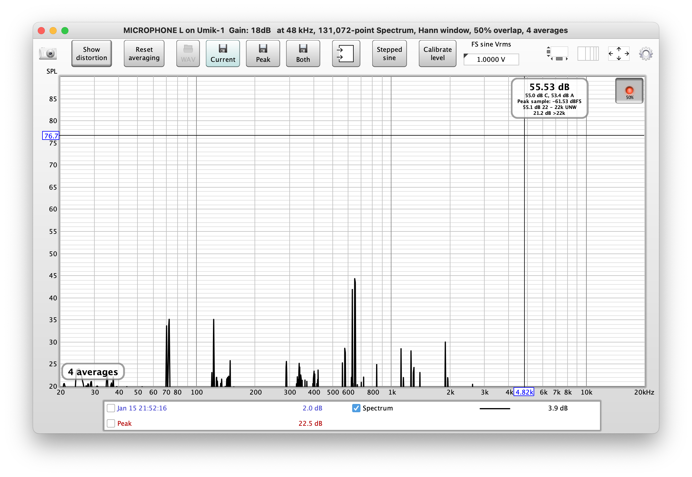
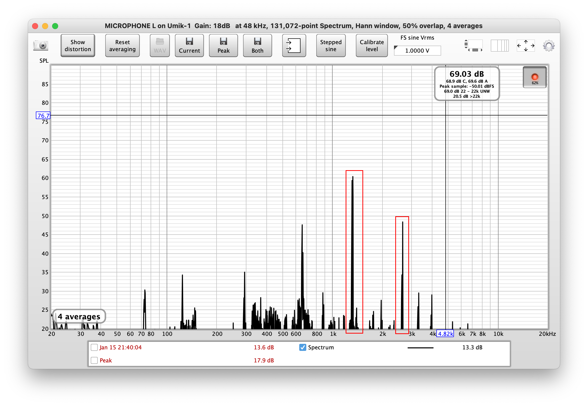
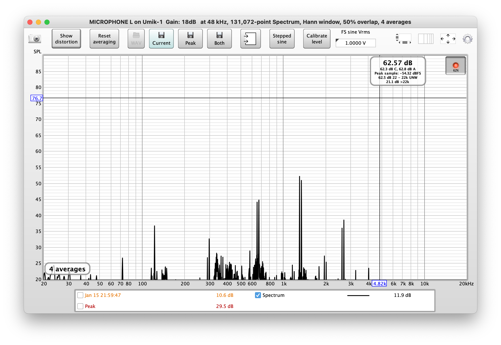
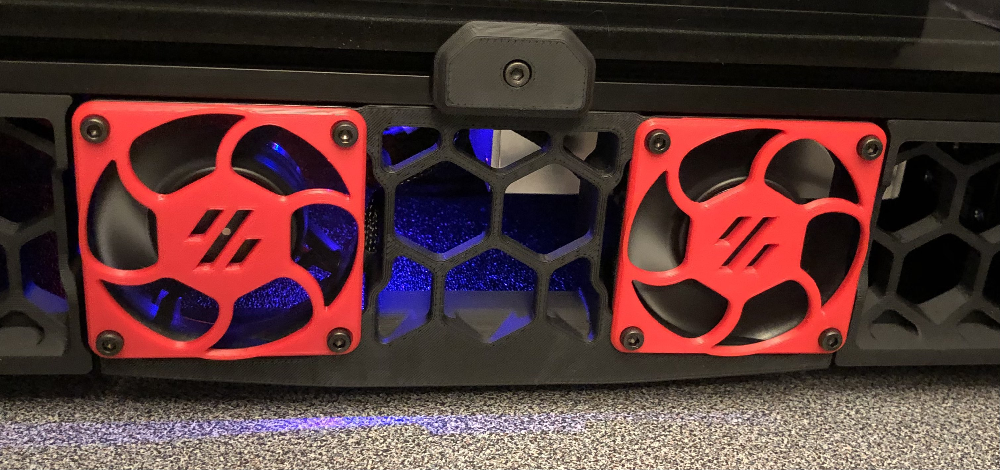

# Acoustic Fan Grilles
When sourcing my Voron 2.4, I carefully selected high quality components including all of the cooling fans.  I do not particularly need the printer to be whisper quiet (no need for a Noctua), but I wanted an unobtrusive acoustic signature.  After some consideration I selected the **NMB 06020SA-24M-EA** 60 mm fans.  I still remember powering them on for the first time with the electronics bay facing upwards and thinking hey, these sound surprisingly good and they push a lot of air.

Fast forward to a few days ago when I installed some additional cosmetic details on my 2.4, including the fan grilles.  The power went on and  I activated the fans.  What!?  What in the world is that prominent droning tone?  I expected some additional noise with the grilles on but this was at headache inducing levels when working in my small cave.  A quick look at the fan and the grilles offers an immediate clue: the fans have nine straight (non-swept) blades and the grilles have six straight struts.  As the leading edges of the blades pass under the struts, the pressure wave from the blade leading edge creates a significant disturbance.  Because of the blade and strut counts, three blades pass under three struts at the exact same time, significantly amplifying these pressure pulses.  This occurs multiple times per revolution and creates a distinct frequency tone...

So what is the solution?  There are several key design features that can be implemented to minimize the acoustic signature of this installation.  The big three are: (1) increase the distance between the blade leading edges and the struts (not really cosmetically suitable for the Voron); (2) make sure that the number of blades and number of struts do not have a common divisor to eliminate any per-rev blade passing patterns (also not cosmetically ideal but doable); and (3) ensure that the blade leading edge passes the struts at an angle rather than parallel.  My solution was to retain the cosmetics but introduce a sweep to the struts, in other words design feature (3):

![[a]_fan_grill_a_acoustic_x2](images/[a]_fan_grill_a_acoustic_x2.png)

To my surprise this simple change reduced the grille strut tone by almost 10 dB, which is roughly equivalent to the tone being half as loud as the spec grilles.  Here are some measurements performed with a calibrated microphone at a distance of approximately 2 feet from the fans:

|  |
| :----------------------------------------------------------: |
|    **Fig.1 - Acoustic Spectrum - No Grilles (Reference)**    |

First let's take a look in Fig.1 at the "baseline" configuration with two fans running side-by-side with no grilles.  Note that the fans create a tone between 600 Hz and 700 Hz at approximately 40 to 45 dB.  Next let's take a look in Fig. 2 that illustrates what happens when we install the spec V2.4R2 grilles.  Note the highlighted two new tones, at 60 and 50 dB levels and right in the "annoying" frequency range.  These would be perceived to be at least twice as loud as the reference tone in Fig.1.  Also note that the SPL of the reference tone increased to almost 50 dB.

|  |
| :----------------------------------------------------------: |
|   **Fig.2 - Acoustic Spectrum - Voron 2.4R2 Spec Grilles**   |

The final plot in Fig.3 shows spectrum reduction with the acoustic grilles installed in place of the spec grilles.  You can see approximately 10 dB reduction in both of the tones that were introduced by the spec grilles.  This would be perceived to be approximately half as loud as the spec grilles.

|  |
| :----------------------------------------------------------: |
|       **Fig.3 - Acoustic Spectrum - Acoustic Grilles**       |

The acoustic grilles lose some of the Voron honeycomb aesthetic but nonetheless look quite nice and, as a bonus, cannot be mistaken for anything other than fans:

Additional considerations:

- Do not expect miracles.  Your fans will still be making (potentially lots of) noise.
- If your fan has swept blades or if it has 5 or 7 blades you may experience a much smaller reduction in noise levels.
- Additional small improvements can be achieved by aerodynamically optimizing the cross-section of the struts.
- A more significant incremental improvement can be achieved by reducing the number of struts from 6 to 4 while retaining their swept geometry.  I did not pursue this as the current noise level is completely acceptable on my printer.

**ReXT3D**
