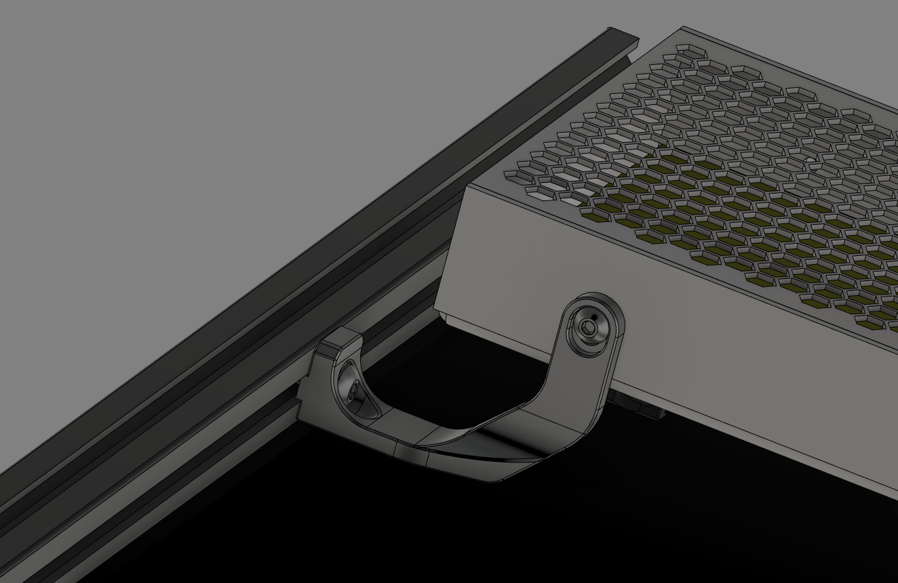
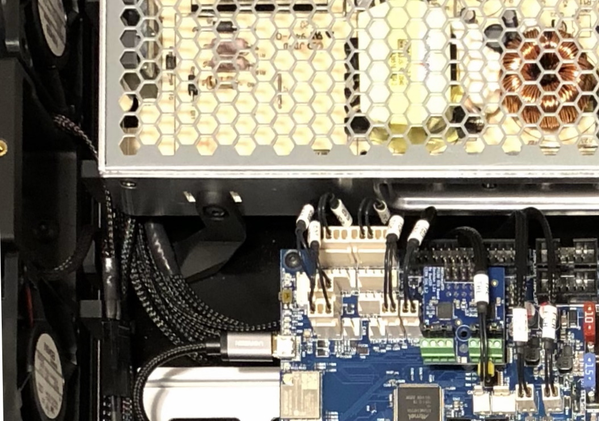

# Low Profile PSU Stabilizer
This is a simple change to the geometry of the stock PSU Stabilizer from Voron 2.4R2 that allows a wiring harness to run along the 2020 extrusion and pass straight over the stabilizer.  The stock design would require the harness to be routed around it.

The main wiring harness in my Voron 2.4 is supported with [deck_support_3mm_x8.stl](https://github.com/VoronDesign/Voron-2/blob/Voron2.4/STLs/Panel_Mounting/deck_support_3mm_x8.stl) brackets and the installation with this low profile PSU stabilizer looks like this:

Note that I slightly adjusted the distance between the deck and the oval slot for the PSU mounting screw in order to better fit the installation geometry.

**ReXT3D**
