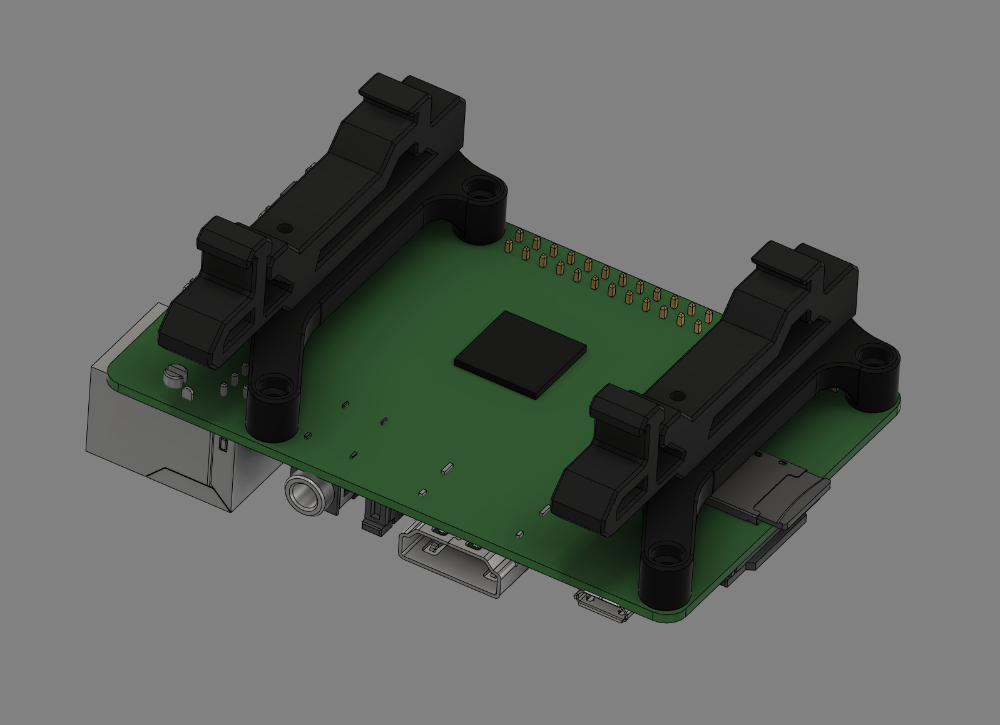
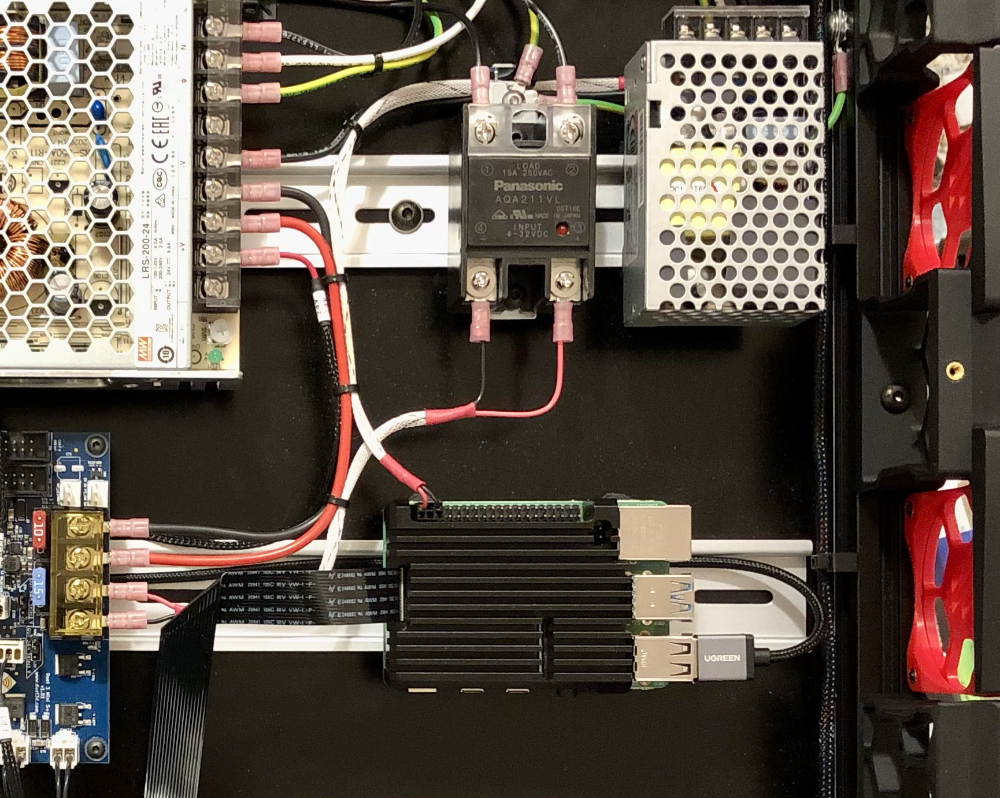

# Pimoroni Pi 4 Heatsink Mounting Brackets
Pi 4 is great (if you can get your hands on one), but it likes to run hot.  From the early stages of planning the Voron build I had my eyes on passive cooling solutions and I REALLY liked the Pimoroni [Aluminium Heatsink Case for Raspberry Pi 4](https://shop.pimoroni.com/products/aluminium-heatsink-case-for-raspberry-pi-4?variant=29430673178707).  The product is great, inexpensive, it performs extremely well and Pimoroni have been wonderful to deal with.

I designed a simple bracket consisting of two identical parts that attach to the large upper Pimoroni heatsink using the supplied fasteners.  These two brackets attach to the standard 2.4R2 DIN clips and allow firm mounting of the complete assembly to the DIN rail:

The heat sink cooling fins are aligned with the direction of colling air flow and provide superb cooling of the Pi 4.  In a 22°C room the Pi stabilizes at around 42°C with fans off and <u>drops</u> to about 36°C under printing load with fans running.  The overall Pi installation becomes really neat and tidy:

**ReXT3D**
