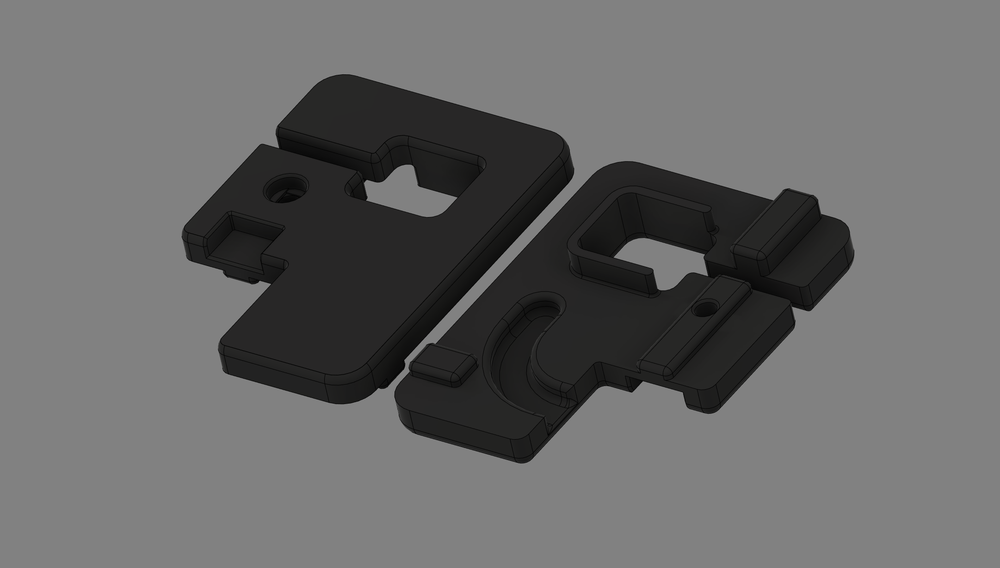
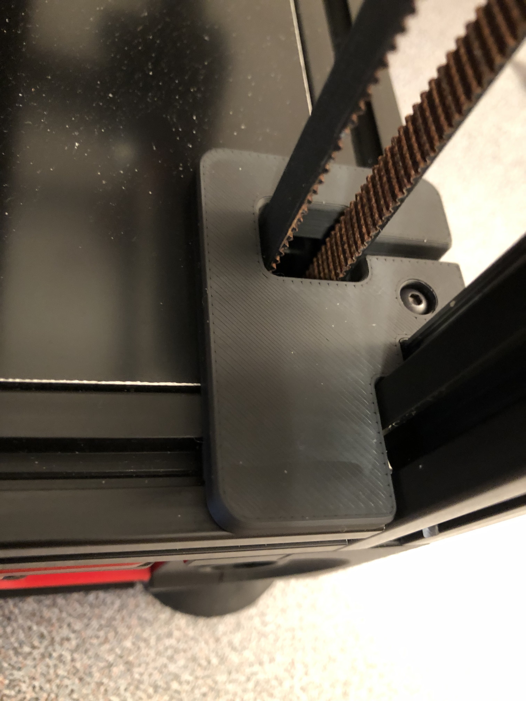

# Z Belt Cover For Harness
I could not find Voron 2.4 style Z belt covers with wiring harness feed-through from the electronics bay to the chamber.  I took the spec design and thickened it to 5mm, introduced a feed-through channel and relocated the mounting screw to be more central (using side extrusions):

These do look quite a bit more substantial when installed due to the increased thickness, but nevertheless quite nice in my opinion.  The increased stiffness also makes the covers sit more flush with the deck panel with no gaps due to bending.

Note that the installation uses the original spec screw that is recessed in the cover.

**ReXT3D**
