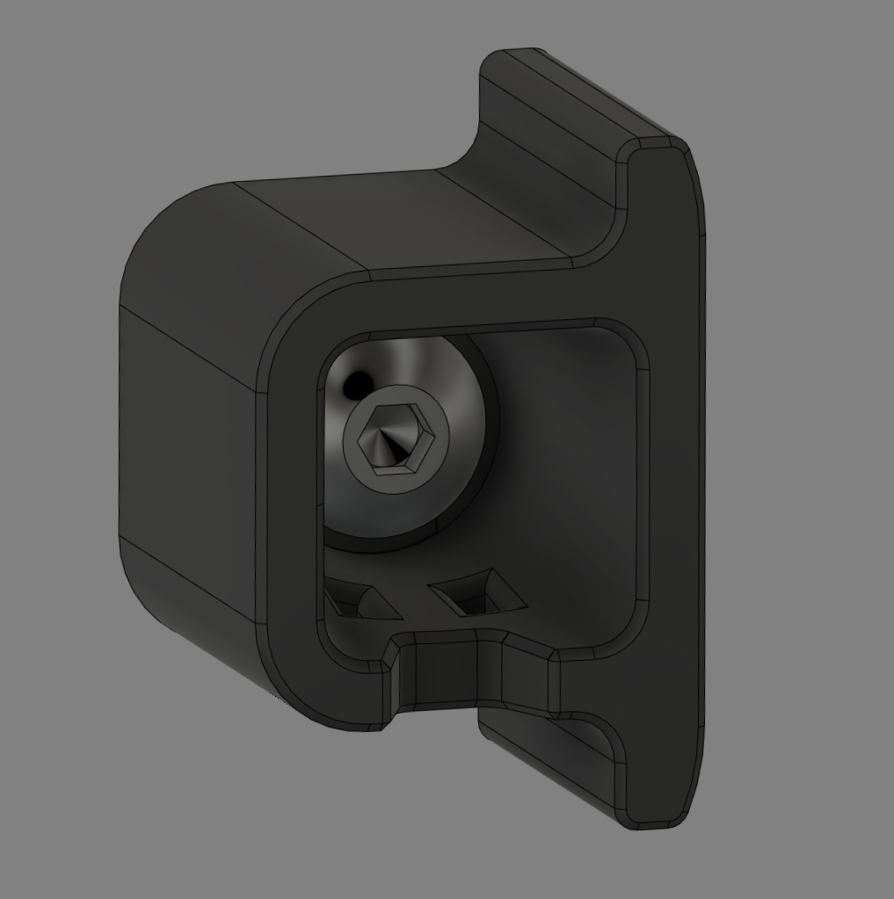
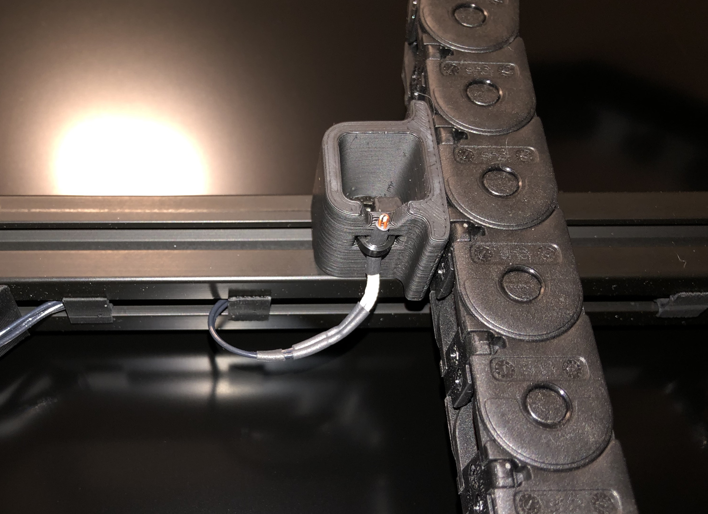

# Z Chain Guide Thermistor
I was looking for a very simple mount for a standard glass bead type thermistor to measure the chamber air temperature.  I was inspired by the existing mod that allows installation of a cylindrical thermistor in the Z chain guide and I modified the spec Z chain guide to install a thermistor using a zip tie.  The modification also includes a trapezoidal cutout that allows the thermistor bead to measure mostly the air temperature (as opposed to component temperature) while somewhat protecting it from external damage:

I soldered a standard hot-end thermistor directly to the PTFE wires and used heat shrink tubing for additional protection.  There is sufficient space to install the zip tie latch on the inside of the chain guide and still access the M5 socket screw:

(The flash lighting was not kind to the print artifacts from my heavily modified CR-10S Pro)

**ReXT3D**
