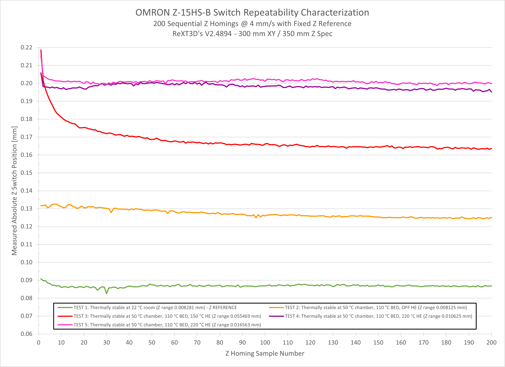

# Z Homing Accuracy & Repeatability
*(I originally wrote this as an addendum to my custom [OMRON Z-15HS-B Mount](https://github.com/ReXT3D/Voron-Mods/tree/main/OMRON%20Z-15HS-B%20Mount), but then decided that it deserved its own location.)*

#### Background & Summary

Printing on my 2.4 has shown excellent overall print quality, but I have been experiencing ongoing issues with inconsistent first layer squish.  This prompted me to investigate the thermal expansion characteristics of my printer as well as the accuracy and repeatability of my non-spec custom Z switch.  After a number of experiments I had three major findings:

1. The influence of chamber temperatures on the Z homing accuracy of my specific printer is negligible
2. The OMRON Z-15HS-B microswitch is very accurate and extremely repeatable
3. The root cause of my first layer squish is likely affecting many Voron owners on printers using physical nozzle contact for Z homing, potentially (but likely to a lesser degree) also including the Voron-Tap

#### Characterization Testing

First let's take a look at the thermal expansion characteristics of my printer that I obtained using **alchemyEngine**'s excellent [measure_thermal_behaviour.py](https://github.com/alchemyEngine/measure_thermal_behavior) script:

I was shocked to see that over the period of three hours following the bed reaching 110 °C the Z reading of my printer has shifted by only about 0.001 mm!  This is likely influenced by some of the modifications I installed during the initial build, particularly the Titanium gantry backers and CNC machined Aluminum Z axis components.  Note that the vertical axis in the above graph is actually the Chamber Temperature and not Frame Temperature, since I do not currently have a frame thermistor installed.  Unfortunately the above test did not explain why I was having issues with first layer squish - it just confirmed that it was definitely not caused by thermal expansion of the frame and components.

As second step of my investigation I imported the data generated by **measure_thermal_behavior.py** into Excel and I plotted the raw Z stop measurements generated during the test:

This data only generated more questions. It clearly shows that not only the OMRON Z-15HS-B microswitch is very repeatable, but also that the overall mechanicals of my printer are typically repeatable within +/-0.001 mm (!!!) on sequential Z switch homing.  I noted the printer mechanical repeatability because the script parks the toolhead between the homing and the toolhead moves from the Z stop switch XY position to the center of the bed every minute during the 3 hour test.  So what in the world is going on with the first layer squish of my printer?

Before going any further I decided to investigate the OMRON Z-15HS-B microswitch accuracy as a function of the plunger velocity.  I did this to identify if there potentially was a "sweet spot" in the homing speed of the nozzle that would result in optimal repeatability of the switch - after all it is a mechanical device that will respond differently to different dynamic input conditions.  This quick and dirty test did not provide any revelations, but it did indicate that the Z stop reading error started very slowly but gradually increasing once the homing speed exceeded 10 mm/s.  I did not investigate this any further, but I suspect that either Klipper timing or more likely the mechanical switch response time becomes a more significant factor at these higher speeds.

Armed with this information I configured the Z axis (second) homing speed to a conservative 4 mm/s and proceeded with an extensive switch repeatability test.  This time I used another excellent Klipper "plugin":  [probe_accuracy.py](https://github.com/KiloQubit/probe_accuracy/blob/main/probe_accuracy.py) by **KiloQubit**.  I used the following general workflow to obtain data that I was looking for from five sequential tests:

1. With printer fully thermally stabilized (overnight) at room temperature, home the printer and then collect data from 200 (two hundred) sequential Z homing requests by issuing the following command:
   `PROBE_Z_ACCURACY PROBE_SPEED=4.0 LIFT_SPEED=10.0 SAMPLES=200 SAMPLE_RETRACT_DIST=2.0`
2. Set bed temperature to 110 °C and thermally stabilize the printer by waiting approximately 2.5 hours after the bed target temperature was reached.  Collect another data set from 200 sequential Z homing requests.  Note that based on the previous data I knew that the printer would not be fully thermally stable at this point, but reasonably close (I have limited play time).
3. Set hot end temperature to 150 °C and thermally stabilize the printer by waiting approximately 15 minutes after the target temperature was reached.  Collect another data set from 200 sequential Z homing requests.  Note that I used the 150 °C hot end "hold temperature" since many people, myself included, use it to prevent excessive nozzle ooze while waiting for the rest of the printer to warm-up.
4. Set hot end temperature to 220 °C and thermally stabilize the printer by waiting approximately 15 minutes after the target temperature was reached.  At this point I had approximately 50 mm of roughly 0.4 mm diameter filament string that "oozed" out of the nozzle and remained attached.  Collect another data set from 200 sequential Z homing requests.
5. With hot end temperature still at 220 °C extrude 50 mm of material at 1 mm/s, then retract 1 mm at 35 mm/s and additional 3 mm at 1 mm/s (this was to simulate my "purge retract" that I used to use at the end of a print to minimize subsequent heat-up ooze).  Wait approximately 15 minutes watching for any unintended nozzle tip "ooze".  At this point I had less than 1 mm of 0.4 mm diameter filament string that "oozed" out of the nozzle and remained attached.  Collect another data set from 200 sequential Z homing requests.

The above workflow produced this rather interesting result:

It is obvious from the above curves that homing Z with the hot end at partial temperature, in my case 150 °C, results in very large, almost 0.07 mm "drift" in the measured Z stop accuracy.  This is in fact is the reason for my first layer squish inconsistencies as I Z home my printer at 150 °C with appropriate offset set to correct for nozzle at print temperatures.  But homing at 150 °C clearly causes excessive position errors, resulting in issues with first layer squish...

In addition, the data also shows very clearly how the Z offset changes on my printer as a consequence of (i) chamber temperature changes and, independently, (ii) nozzle temperature changes.  Finally, it confirms that the OMRON Z-15HS-B microswitch has excellent repeatability.  This is all very useful information.

#### Conclusions

So what's going on here?  The drift is caused by small amounts of filament extruding out of the nozzle tip at 150 °C, on the order of 0.2-0.3 mm in my case.  The filament is sufficiently plastic to push out of the nozzle, but as soon as it touches the cooler surface of the Z switch plunger it solidifies causing an incorrect reading.  Repetitive homing operations continue to squish the tiny bit of plastic until the nozzle tip eventually contacts the stop plunger.  In my case this required about 100 repetitive homing contacts!  I suspect that with a large solid metal plunger such as the stock design or SexBolt, obtaining correct reading may require even a larger number of homing events.  It is also worth noting that with the hot end at print temperature, this same phenomenon settles down very quickly, literally within two or three homing operations.  And this much improved result does not seem to be affected by the amount of filament that "oozes" out of the nozzle prior to homing.

Theoretically there is a potential for similar behavior when using the new Voron-Tap for homing / probing.  In particular, the Tap requires reasonably low nozzle temperatures during probing in order to prevent damage to the (typically PEI) print surface.  However, the print surface will be at higher temperature than the Z switch plunger and has much reduced thermal conductivity, so the potential for filament solidification at the nozzle tip during probing will be significantly reduced.  In addition, Tap applies significantly larger force to the nozzle (~ 5.9 N) than typical Z switches which will accelerate the squish progression of any unwanted filament.  For reference, the OMRON Z-15HS-B is specified at 1.96 to 2.79 N operating force, so roughly 1/3 to 1/2 of the Voron Tap but 3 to 4 times higher than 0.74 N of the spec D2F-01L microswitch.

#### Recommendations

There can be many reasons for inconsistent first layer squish, but the above data shows that such inconsistencies are possible even on very well tuned printers with robust mechanicals.  Each case must therefore be independently evaluated to identify the potential root cause(s).

In my specific case, I addressed the first layer inconsistencies by eliminating Z homing with reduced nozzle temperatures.  I now perform the final Z homing of my printer with the nozzle at print temperature and I reduce the amount of filament oozing by performing larger "purge retractions" (currently 3 mm at 35 mm/s) in the `PRINT_END` macro.  In addition, I also modified my `PRINT_START` macro to perform total of three final Z homings in quick succession after the QGL, all with the nozzle stabilized at print temperature.  This approach produces predicable and consistent first layers that, to date, require either no intervention at all or at most 0.01 mm of adjustment.

Automatic brush cleaning of the nozzle tip immediately prior to the final Z homing should also help, although the brush may not be completely effective at reduced nozzle temperatures.  Unfortunately I do not currently have a brush installed to collect the required data.

I may update this with additional information as I continue to explore the nuances of my setup.

**ReXT3D**
